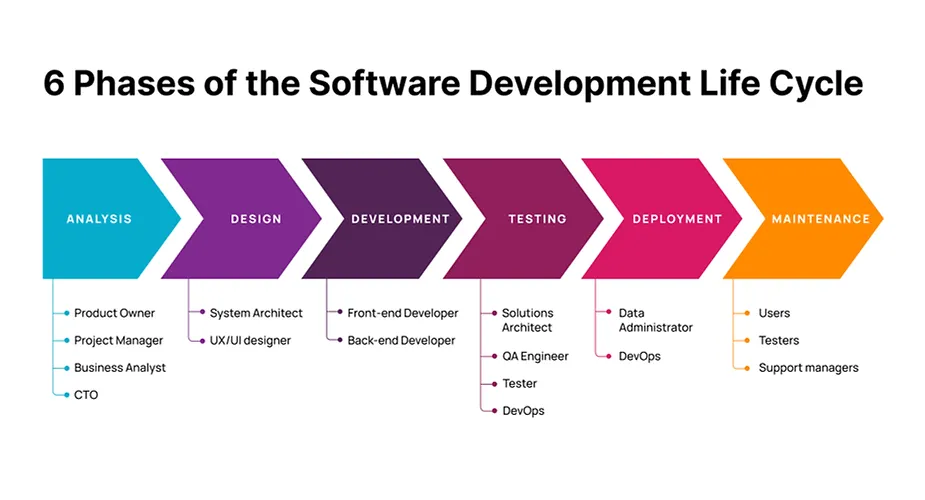

*This diagram illustrates the 6 key phases of the SDLC and the professional roles involved in each stage.*

## What is SDLC?

SDLC stands for **Software Development Life Cycle**.

It is a structured process that defines **how software is planned, built, tested, and delivered**. Think of it as a roadmap that a team follows every time they need to create or update a software system.

Without SDLC, software development would be chaotic — developers would write code randomly, testers would have nothing to test against, and nobody would know when the project was actually done.

> *SDLC brings order to the complexity of building software.*

---

## Why Does SDLC Matter?

Before SDLC was formalized, software projects failed constantly:

- Projects ran **over budget**
- Releases were **months or years late**
- Software was **full of bugs** that were found too late
- Teams had **no clear communication** about what was being built

SDLC was the answer to these problems. It gave teams a **repeatable, predictable process** so that building software felt less like guesswork and more like engineering.

### Key Benefits of SDLC

| Benefit | What it means in practice |
|---|---|
| **Clarity** | Everyone knows what they are building and why |
| **Structure** | Each phase has a clear start and end point |
| **Quality** | Testing is built into the process, not an afterthought |
| **Predictability** | Teams can estimate timelines and budgets more accurately |
| **Risk Reduction** | Problems are caught early before they become expensive |

---

## The 6 Phases of SDLC

Every SDLC model — regardless of which one you use — follows these six core phases:

## The Phases of SDLC

| Phase | DevOps Action | Tooling |
| :--- | :--- | :--- |
| **1. Planning** | Requirement Gathering | Jira, Confluence |
| **2. Analysis** | Feasibility Study | Slack, Design Docs |
| **3. Design** | Architecture Blueprint | LucidChart, Draw.io |
| **4. Development** | Writing Code | VS Code, Git |
| **5. Testing** | Quality Assurance | Selenium, PyTest |
| **6. Deployment** | CI/CD Release | Jenkins, GitHub Actions |
| **7. Maintenance** | Monitoring & Patching | Prometheus, Grafana |

### Phase 1 — Planning 📋

**What happens:** The team decides *what* to build and *why*.

- Business goals are defined
- Feasibility is checked (is this technically possible? is it worth the cost?)
- Resources, timeline, and budget are estimated
- Risks are identified early

**Simple example:** A company decides they need an online payment system. The planning phase answers: *How long will it take? How much will it cost? What could go wrong?*

---

### Phase 2 — Requirements Analysis 📝

**What happens:** The team gathers detailed requirements from stakeholders — exactly what the software must do.

- Functional requirements: *What should the system do?*
- Non-functional requirements: *How fast should it be? How secure?*
- Requirements are documented and signed off by all parties

**Simple example:** The payment system must support credit cards, process payments under 3 seconds, and work in 10 languages.

---

### Phase 3 — System Design 🏗️

**What happens:** Engineers translate requirements into a technical blueprint.

- Architecture is designed (databases, servers, APIs)
- UI/UX wireframes are created
- Technology stack is chosen
- Security and infrastructure planning happens here

**Simple example:** The team decides to use a microservices architecture on AWS, with a React frontend and a PostgreSQL database.

---

### Phase 4 — Implementation (Coding) 💻

**What happens:** Developers actually write the code based on the design documents.

- Frontend developers build the user interface
- Backend developers build the business logic and APIs
- DevOps engineers set up servers and pipelines
- Code reviews happen here

**Simple example:** Developers write the payment processing logic, connect it to a payment gateway like Stripe, and build the checkout UI.

---

### Phase 5 — Testing 🧪

**What happens:** The software is tested against the requirements to find and fix bugs.

| Test Type | Purpose |
|---|---|
| **Unit Testing** | Test individual functions in isolation |
| **Integration Testing** | Test how different parts work together |
| **Performance Testing** | Test speed and stability under load |
| **Security Testing** | Check for vulnerabilities |
| **UAT (User Acceptance Testing)** | Real users test if it meets their needs |

**Simple example:** The QA team discovers the payment fails when a user has a slow internet connection. Developers fix it before release.

---

### Phase 6 — Deployment & Maintenance 🚀

**What happens:** The software is released to real users and kept running.

- Code is deployed to production servers
- Users start using the system
- Bugs reported by users are fixed
- New features begin the cycle again from Phase 1

**Simple example:** The payment system goes live. The first week, users report a bug with a specific bank. The team fixes it and deploys a patch.

---

## A Brief History of SDLC

### 1950s–1960s — The Beginning

The earliest computers were programmed without any formal process. Code was written directly in machine language by scientists and engineers. There was no concept of a "software project" — hardware was the focus, software was secondary.

As computers became more commercial, the lack of process caused serious failures. The US Department of Defense commissioned studies to understand why software projects kept going over budget and failing.

---

### 1970 — Waterfall is Born

In 1970, computer scientist **Winston W. Royce** published a paper describing a sequential software development process. Although Royce himself noted its flaws, the industry adopted it as the standard — and called it **Waterfall**.

Requirements → Design → Implementation → Testing → Deployment → Maintenance
↓              ↓             ↓            ↓           ↓
(one way — no going back easily)

**Why it made sense at the time:**
- Software was built like physical engineering (bridges, buildings)
- Requirements rarely changed mid-project
- Teams were small and co-located

**The problem that emerged:**
- Business needs *do* change mid-project
- Bugs found in testing meant going all the way back to design
- A release took 1–2 years — by which time the requirements were already outdated

---

### 1980s — Iterative and Spiral Models

Engineers realized that a purely sequential process was too rigid. New models emerged:

- **Iterative Model** — Build a small version, get feedback, improve it, repeat
- **Spiral Model** (Barry Boehm, 1986) — Combined iterative development with risk analysis at every stage

These were improvements, but still heavyweight and document-heavy. They were better suited for large government or defense contracts than everyday software development.

---

### 1990s — RAD and the Speed Problem

As personal computers and the internet became mainstream, the speed of software delivery became critical. Businesses needed software faster than Waterfall allowed.

**Rapid Application Development (RAD)** emerged — using prototypes and user feedback to build software quickly. Tools like Visual Basic made it possible for small teams to build and ship faster.

But RAD lacked discipline — fast delivery often came at the cost of quality and documentation.

---

### 2001 — The Agile Revolution

Seventeen software developers gathered in Snowbird, Utah and published the **Agile Manifesto** — four values and twelve principles that changed how the world builds software.

The core shift:

| Old Thinking (Waterfall) | New Thinking (Agile) |
|---|---|
| Follow a plan rigidly | Respond to change |
| Deliver software once at the end | Deliver working software frequently |
| Contract negotiation | Customer collaboration |
| Comprehensive documentation | Working software |

Agile gave birth to frameworks like **Scrum** and **Kanban**, which became the dominant ways of organizing software teams.

**But Agile had a blind spot:** it focused on how developers work, not on how software gets deployed and operated. Development got faster — but operations was still manual and slow. This created a new bottleneck.

---

### 2009 — DevOps Fills the Gap

Agile made development fast. But code sitting in a repository waiting weeks to be manually deployed to production defeated the purpose.

**DevOps was born to fix this.**

Agile fixed:    Plan → Build → Test  ✅
DevOps fixed:   Deploy → Operate → Monitor  ✅

The combination of Agile + DevOps completed the loop — fast development AND fast, reliable delivery.

---

## SDLC Models at a Glance

| Model | Era | Speed | Flexibility | Best For |
|---|---|---|---|---|
| **Waterfall** | 1970s | Slow | Very Low | Fixed-scope government/defense projects |
| **Spiral** | 1980s | Medium | Medium | Large, high-risk projects |
| **RAD** | 1990s | Fast | Medium | Prototypes and small apps |
| **Agile/Scrum** | 2001+ | Fast | High | Most modern software products |
| **DevOps** | 2009+ | Very Fast | Very High | Cloud-native, continuous delivery |

---

## SDLC and DevOps — How They Connect

SDLC did not disappear when DevOps arrived. DevOps is actually an **evolution of SDLC**, not a replacement.

Here is how each SDLC phase maps to modern DevOps practices:

| SDLC Phase | DevOps Practice |
|---|---|
| Planning | Backlog grooming, sprint planning |
| Requirements | User stories, acceptance criteria |
| Design | Architecture reviews, RFC documents |
| Implementation | Feature branches, code reviews, pair programming |
| Testing | Automated CI pipelines, unit + integration tests |
| Deployment | CD pipelines, blue-green deployments, canary releases |
| Maintenance | Monitoring, alerting, on-call, SRE practices |

The biggest difference: in traditional SDLC, these phases happened **once** in a long cycle. In DevOps, they happen **continuously** — sometimes multiple times per day.

---

## Key Takeaway

> SDLC taught us *what* steps are needed to build software.
> Agile taught us to do those steps *faster and iteratively*.
> DevOps taught us to *automate and own* the entire cycle end to end.

Understanding SDLC is not just history — it explains every architectural decision, every process choice, and every tool you will encounter in a modern DevOps role.

---

